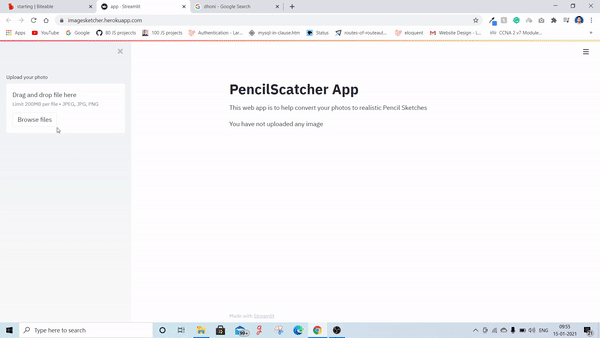

# imageSketch-streamlit-python

## Setup
> To run this you have to install latest python 3.6-3.8 and make sure you have install latest verson of pip

```
$ git clone https://github.com/jyotiprakash-m/imageSketch-streamlit-python.git
$ cd imageSketch-streamlit-python
$ pip install -r requirments.txt 
$ streamlit run app.py
```

## Demo video


## Deploy 
I deploy this app on heroku . You can try it out from the below link
[https://imagesketcher.herokuapp.com/](https://imagesketcher.herokuapp.com/)
